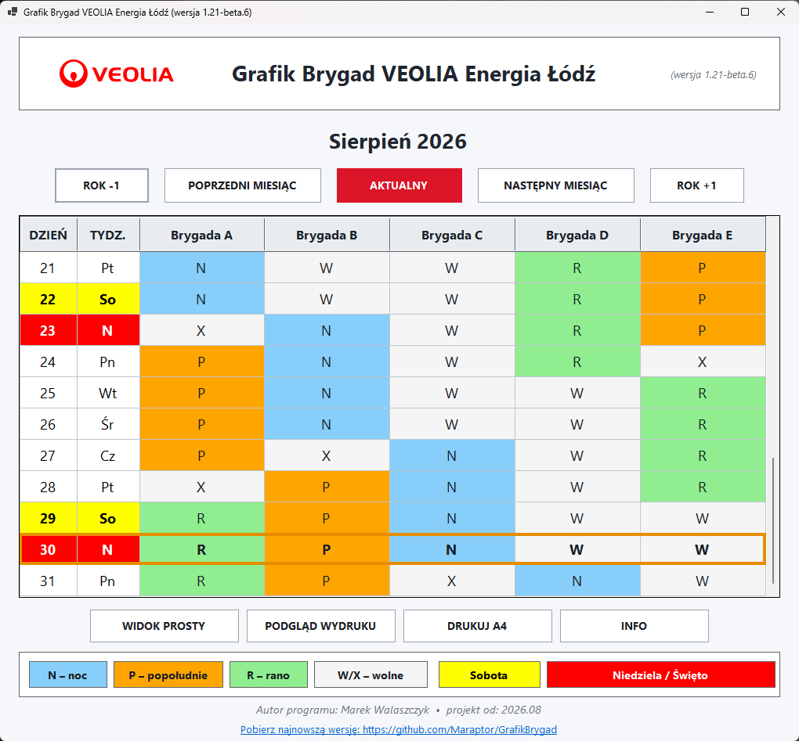
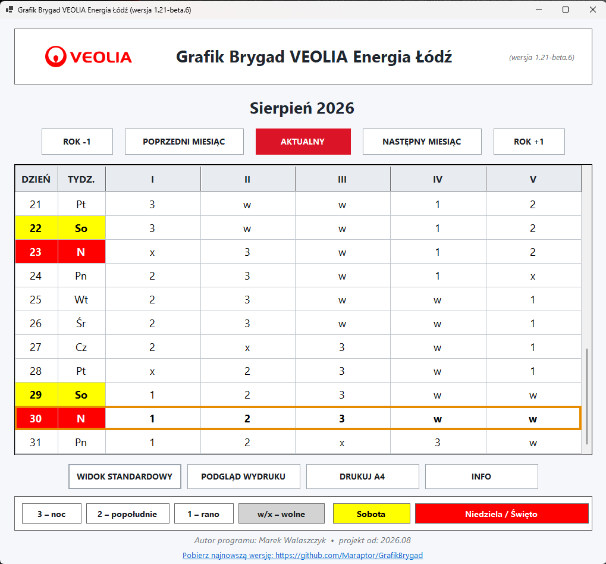
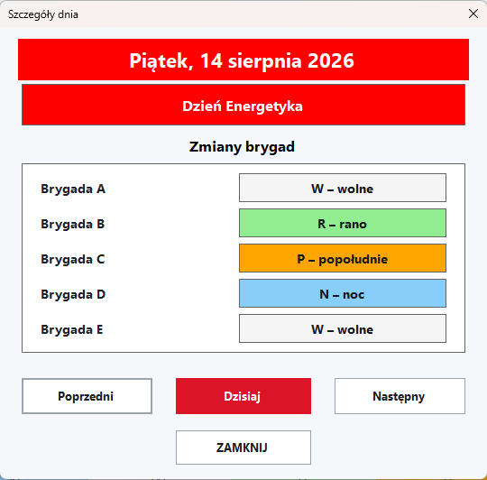
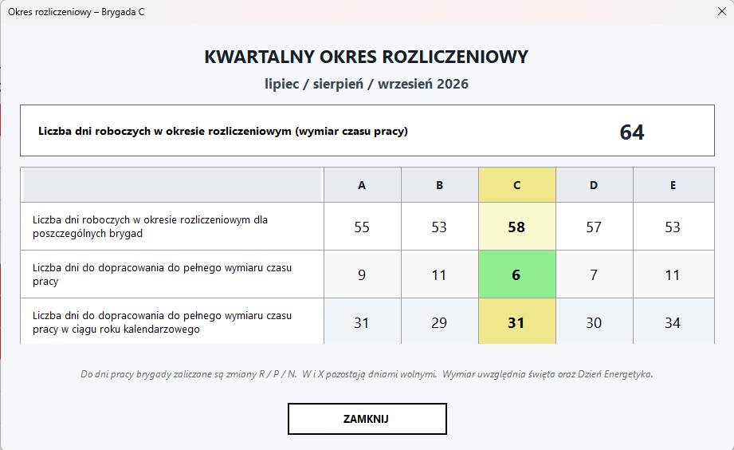

# Grafik Brygad VEOLIA Energia Łódź

Aplikacja Windows Forms w języku C# do prezentowania cyklicznego grafiku pracy pięciu brygad A–E.

**Aktualna stabilna wersja: v1.21**

## Najważniejsze funkcje

- automatyczny grafik pięciu brygad,
- 20-dniowy cykl `NNNNXPPPPXRRRRWWWWWW`,
- **Widok Standardowy** R / P / N / W / X,
- **Widok Prosty** I–V oraz 1 / 2 / 3 / w / x,
- jaśniejsze pola W/X w Widoku Standardowym,
- niedzielne korekty zmiany R,
- obsługa świąt i Dnia Energetyka 14 sierpnia,
- specjalna prezentacja pracy P/N 31 grudnia,
- nawigacja po miesiącach i latach,
- kliknięcie dnia lub dnia tygodnia otwiera **Szczegóły dnia**,
- kliknięcie nagłówka brygady otwiera **Kwartalny okres rozliczeniowy**,
- kwartalne i roczne obliczenia dni do dopracowania,
- przycisk **INFO** z krótką instrukcją obsługi,
- podgląd wydruku o stałym, bezpiecznym rozmiarze,
- **wydruk całego kwartału na jednej stronie A4 w orientacji poziomej**,
- skalowanie interfejsu PerMonitorV2,
- instalator Windows x64,
- krótka nazwa skrótu na pulpicie: **Grafik Brygad**.

## Widoki programu

### Widok Standardowy

Kolorowy widok wykorzystujący symbole:

- `N` – noc,
- `P` – popołudnie,
- `R` – rano,
- `W/X` – dni wolne.

Pola W/X są celowo bardzo jasne, aby zmiany robocze były lepiej widoczne.

### Widok Prosty

Widok zbliżony do papierowego grafiku VEOLIA. Kolumny brygad są oznaczone I–V, a zmiany symbolami `1 / 2 / 3 / w / x`.

## Szczegóły dnia

Kliknięcie numeru dnia albo skrótu dnia tygodnia otwiera okno **Szczegóły dnia**. Okno pokazuje datę, ewentualne święto lub Dzień Energetyka oraz zmianę każdej brygady.

## Kwartalny okres rozliczeniowy

Kliknięcie nagłówka wybranej brygady otwiera kwartalne okno okresu rozliczeniowego. Program pokazuje:

- liczbę dni roboczych w okresie rozliczeniowym (wymiar czasu pracy),
- liczbę dni roboczych w harmonogramie poszczególnych brygad,
- liczbę dni do dopracowania do pełnego wymiaru czasu pracy w kwartale,
- liczbę dni do dopracowania do pełnego wymiaru czasu pracy w roku kalendarzowym.

Wybrana brygada jest dodatkowo wyróżniona w tabeli.

## Wydruk kwartalny

Przyciski **PODGLĄD WYDRUKU** i **DRUKUJ A4** przygotowują cały aktualny kwartał na jednej stronie A4 w orientacji poziomej.

Na wydruku znajdują się trzy miesiące ustawione obok siebie oraz podsumowanie okresu rozliczeniowego:

- wymiar czasu pracy,
- liczba dni pracy poszczególnych brygad,
- liczba dni do dopracowania,
- nazwa okresu rozliczeniowego.

Wydruk respektuje aktualnie wybrany Widok Standardowy lub Widok Prosty.

## Instalacja

Zalecana paczka instalacyjna:

`GrafikBrygad-v1.21-Setup.zip`

Po uruchomieniu instalatora v1.21 istniejąca instalacja poprzedniej wersji zostanie zaktualizowana dzięki zachowaniu tego samego `AppId`.

Skrót tworzony na pulpicie ma nazwę:

`Grafik Brygad`

## Wymagania projektu

- Windows,
- Visual Studio z obsługą aplikacji klasycznych .NET,
- .NET 10,
- Windows Forms,
- konfiguracja docelowa `net10.0-windows`.

Projekt korzysta z plików:

- `Images/veolia.png`
- `Images/GrafikBrygad.ico`

## Publikacja

Zalecane ustawienia publikacji:

- konfiguracja: **Release**,
- środowisko docelowe: **win-x64**,
- tryb: **Self-contained**.

Pliki publikacji powinny znaleźć się w:

`publish/win-x64`

Następnie należy skompilować skrypt Inno Setup:

`Installer/GrafikBrygad-v1.21.iss`

Wynik:

`GrafikBrygad-v1.21-Setup.exe`

Do GitHub Release zalecane jest spakowanie instalatora jako:

`GrafikBrygad-v1.21-Setup.zip`

## Co nowego w v1.21

W porównaniu z v1.20 dodano i poprawiono między innymi:

- zmianę nazwy przycisku z „WIDOK VEOLIA” na **„WIDOK PROSTY”**,
- nowe okno **INFO** z instrukcją użytkowania,
- skróconą nazwę ikony instalowanej na pulpicie do **„Grafik Brygad”**,
- całkowicie nowy, ekonomiczny **wydruk kwartalny A4**,
- stabilny rozmiar i pozycję okna Podglądu wydruku,
- dopracowanie tekstów i czcionek w oknie okresu rozliczeniowego,
- jaśniejsze pola W/X w Widoku Standardowym, szczegółach dnia i wydruku.

## Autor

Marek Walaszczyk

Projekt rozpoczęty: **2026.08**
