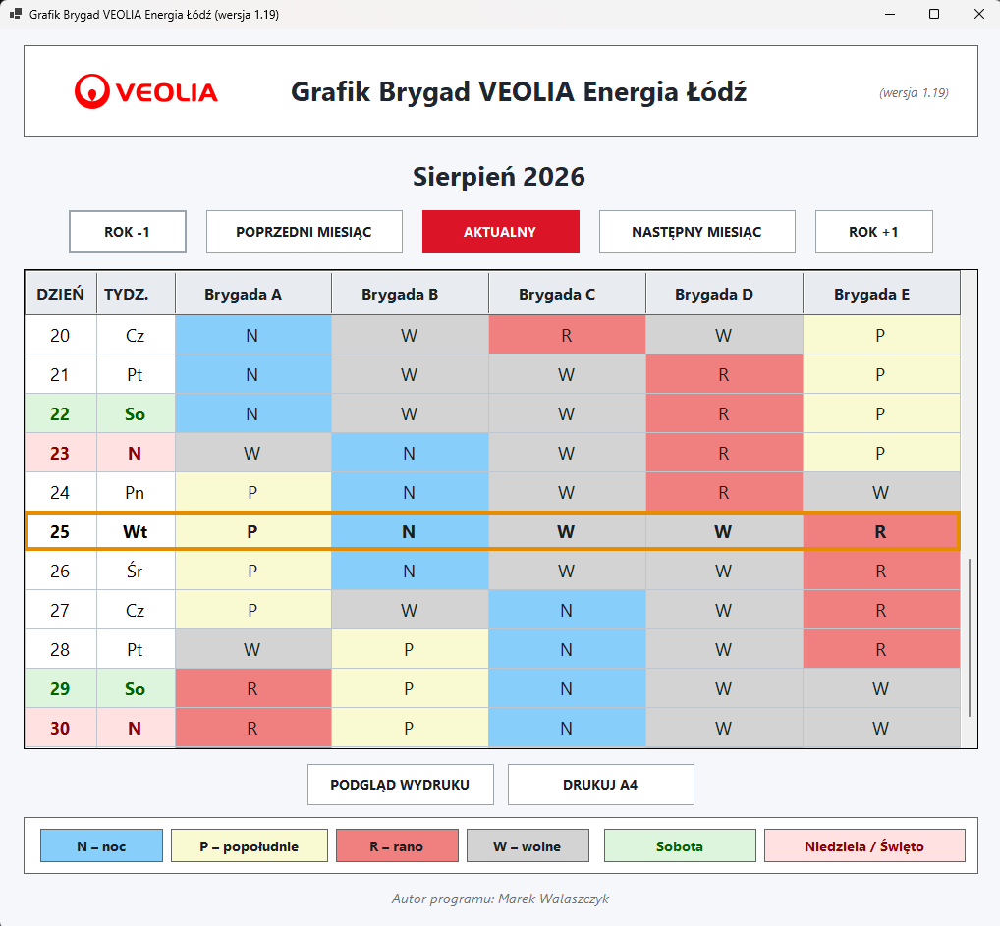
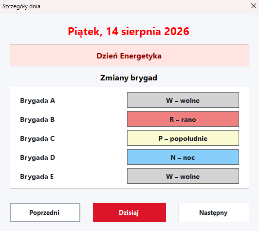

# Grafik Brygad VEOLIA Energia Łódź

Aplikacja Windows Forms w języku C# do czytelnego prezentowania
cyklicznego grafiku pracy pięciu brygad: **A, B, C, D i E**.

Aktualna stabilna wersja: **v1.19**

## Podgląd programu

### Główne okno grafiku

Główne okno prezentuje 11 dni grafiku jednocześnie. Aktualny dzień jest
wyróżniony ramką i automatycznie ustawiany w środkowej części widoku.

### Szczegóły dnia

Po wybraniu dnia można zobaczyć pełną datę, nazwę święta oraz zmiany
wszystkich pięciu brygad.

## Najważniejsze funkcje

-   automatyczny, cykliczny grafik dla pięciu brygad **A--E**,
-   oznaczenia zmian: **N -- noc**, **P -- popołudnie**, **R -- rano**,
    **W -- wolne**,
-   11 widocznych dni dla większej czytelności,
-   szybka nawigacja o **miesiąc** oraz o **rok** w przód i wstecz,
-   przycisk **AKTUALNY** przywracający widok bieżącej daty,
-   automatyczne wyróżnienie aktualnego dnia,
-   **soboty oznaczone na zielono**,
-   **niedziele i święta oznaczone na czerwono**,
-   obsługa polskich świąt stałych i ruchomych,
-   uwzględnienie **Dnia Energetyka -- 14 sierpnia**,
-   podpowiedź nazwy święta po wskazaniu daty,
-   okno **Szczegóły dnia** z pełnymi nazwami zmian,
-   nawigacja **Poprzedni / Dzisiaj / Następny** w szczegółach dnia,
-   podgląd wydruku i drukowanie grafiku w formacie A4,
-   własna ikona aplikacji,
-   instalator Windows x64 ze skrótem w menu Start i opcjonalnym skrótem
    na pulpicie.

## Instalacja -- zalecany sposób

1.  Otwórz najnowsze stabilne wydanie w sekcji **Releases**
    repozytorium.
2.  W sekcji **Assets** pobierz `GrafikBrygad-v1.19-Setup.zip`.
3.  Rozpakuj pobrany plik ZIP.
4.  Uruchom `GrafikBrygad-v1.19-Setup.exe`.
5.  Przejdź przez kolejne kroki instalatora.
6.  Po instalacji uruchamiaj program ze skrótu w menu Start lub z
    pulpitu.

Instalator v1.19 zawiera samodzielną publikację **Windows x64**, dlatego
do uruchomienia zainstalowanej aplikacji nie jest wymagane osobne
instalowanie środowiska .NET.

> **Uwaga:** instalator nie jest obecnie podpisany komercyjnym
> certyfikatem Code Signing. Windows może więc wyświetlić komunikat
> zabezpieczeń dla pliku pobranego z Internetu.

## Wersje programu

Projekt korzysta z dwóch rodzajów wydań:

-   **stabilne**, np. `v1.19` -- wersje po zakończeniu testów,
-   **beta**, np. `v1.20-beta.1`, `v1.20-beta.2` -- wersje rozwojowe
    przeznaczone do testowania nowych funkcji.

Wydania beta są publikowane jako **Pre-release**, a najnowsze sprawdzone
wydanie stabilne jako **Latest**.

## Uruchamianie projektu ze źródeł

Projekt jest aplikacją **Windows Forms / C#** i korzysta z docelowej
struktury `net10.0-windows`.

Do pracy ze źródłami potrzebne jest środowisko Visual Studio z obsługą
aplikacji klasycznych .NET oraz odpowiedni .NET SDK.

Po sklonowaniu repozytorium należy upewnić się, że w katalogu `Images`
znajdują się zasoby używane przez aplikację, w szczególności:

-   `veolia.png`
-   `GrafikBrygad.ico`

## Publikowanie wersji Windows x64

Stabilne wydanie programu jest publikowane w konfiguracji:

-   **Release**
-   **net10.0-windows**
-   **Self-contained / Samodzielny**
-   **win-x64**

Pliki publikacji są następnie wykorzystywane przez skrypt Inno Setup
znajdujący się w katalogu `Installer`.

## Instalator

Repozytorium zawiera skrypt `Installer/GrafikBrygad-v1.19.iss`.

Wygenerowane pliki instalatora znajdują się lokalnie w
`Installer/Output` i nie są dodawane bezpośrednio do historii Git.
Gotowy instalator jest udostępniany jako plik ZIP w **Assets**
odpowiedniego GitHub Release.

## Autor

**Marek Walaszczyk**

## Informacja

Projekt został przygotowany jako narzędzie do prezentacji grafiku
brygad. Nazwy i znaki towarowe należą do ich odpowiednich właścicieli.
