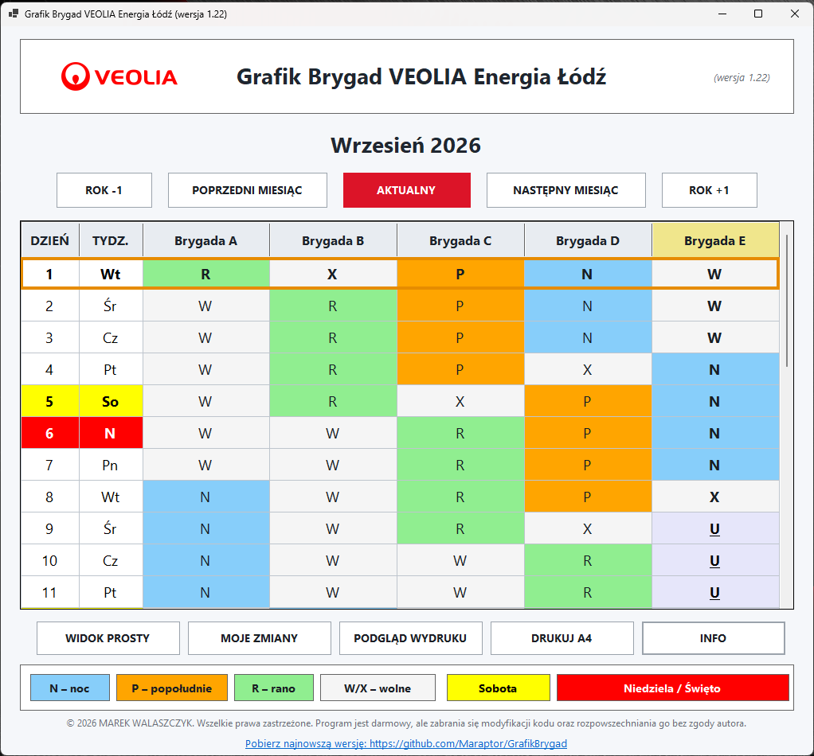
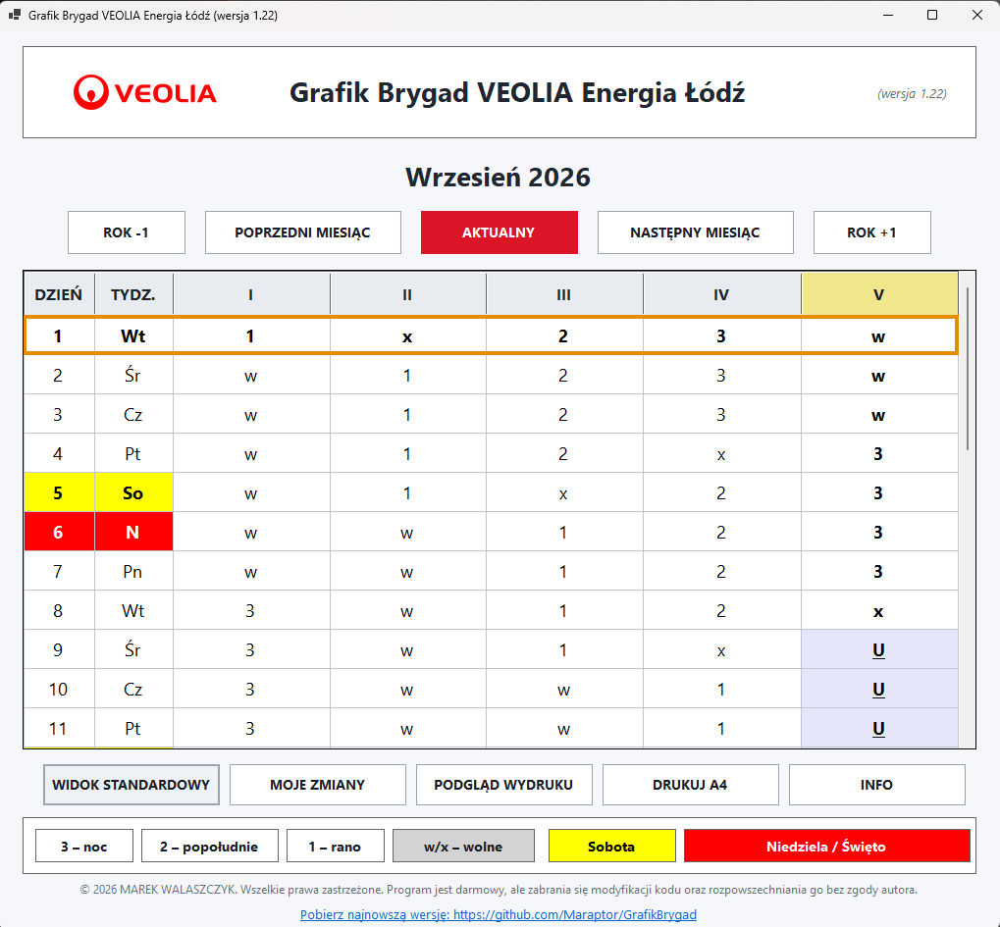
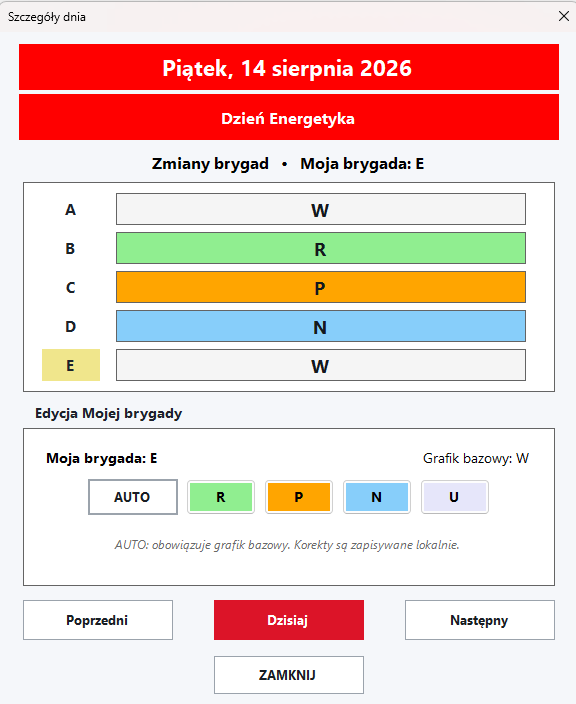
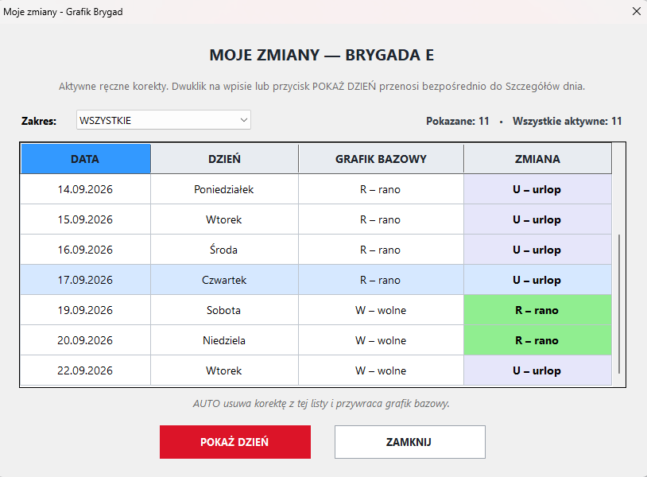
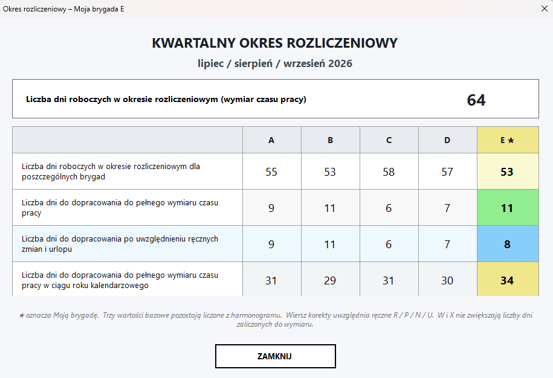
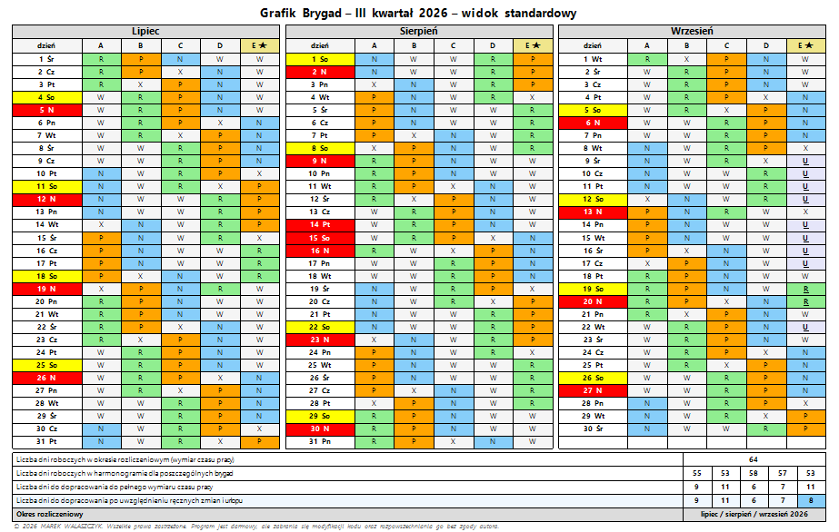

# Grafik Brygad VEOLIA Energia Łódź

**Aktualna wersja: 1.22**

Windowsowa aplikacja w C# / Windows Forms do prezentacji cyklicznego
grafiku pięciu brygad zmianowych, obsługi własnej brygady, ręcznych
korekt grafiku, kwartalnych okresów rozliczeniowych oraz wydruku A4.

> © 2026 MAREK WALASZCZYK. Wszelkie prawa zastrzeżone.\
> Program jest darmowy, ale zabrania się modyfikacji kodu oraz
> rozpowszechniania go bez zgody autora.

## Najważniejsze funkcje

-   automatyczne wyliczanie grafiku pięciu brygad w cyklu 20-dniowym,
-   dwa sposoby prezentacji: **Widok standardowy** oraz **Widok
    prosty**,
-   szybka nawigacja: poprzedni/następny miesiąc, aktualny miesiąc oraz
    rok -1 / +1,
-   oznaczenie sobót, niedziel i świąt,
-   okno **Szczegóły dnia** otwierane kliknięciem dowolnego pola danego
    dnia,
-   wybór **Mojej brygady** jako brygady nadrzędnej użytkownika,
-   ręczna korekta własnego grafiku: **R / P / N / U** oraz powrót do
    harmonogramu przez **AUTO**,
-   trwały lokalny zapis ręcznych korekt,
-   okno **Moje zmiany** z listą wszystkich aktywnych korekt,
-   filtry zmian: **Wszystkie / Bieżący rok / Bieżący kwartał**,
-   bezpośrednie przejście z listy zmian do wybranego dnia,
-   kwartalny okres rozliczeniowy z uwzględnieniem ręcznych zmian i
    urlopu,
-   kwartalny podgląd wydruku i wydruk A4,
-   wyróżnienie Mojej brygady również w podsumowaniach i na wydruku.

## Oznaczenia zmian

  Symbol     Znaczenie
  ---------- ------------------------------------------------
  **R**      zmiana rano
  **P**      zmiana popołudniowa
  **N**      zmiana nocna
  **W**      dzień wolny
  **X**      chroniony dzień wolny wynikający z cyklu
  **U**      urlop
  **AUTO**   usuwa ręczną korektę i przywraca grafik bazowy

W **Widoku prostym** zmiany są przedstawiane jako `1 – rano`,
`2 – popołudnie`, `3 – noc`, natomiast dni wolne pozostają oznaczone
jako `W/X`.

## Widok standardowy

Kolorowy widok pokazuje bezpośrednio oznaczenia **R / P / N / W / X /
U** dla wszystkich pięciu brygad. Moja brygada jest wyróżniona w
nagłówku.

## Widok prosty

Alternatywny widok wykorzystuje oznaczenia **1 / 2 / 3 / W / X / U** i
zachowuje wszystkie funkcje nawigacji oraz edycji.

## Szczegóły dnia i ręczna edycja

Kliknięcie dowolnej komórki w wierszu dnia otwiera okno **Szczegóły
dnia**. Pokazywane są zmiany wszystkich brygad, natomiast edycja dotyczy
wyłącznie ustawionej **Mojej brygady**.

Dostępne korekty:

-   **R** -- rano,
-   **P** -- popołudnie,
-   **N** -- noc,
-   **U** -- urlop,
-   **AUTO** -- przywrócenie grafiku bazowego.

Korekty są zapisywane lokalnie i pozostają aktywne po ponownym
uruchomieniu programu.

## Moje zmiany

Okno **Moje zmiany** umożliwia szybkie odnalezienie wszystkich wcześniej
wprowadzonych ręcznych korekt bez przeglądania grafiku miesiąc po
miesiącu.

Lista pokazuje:

-   datę,
-   dzień tygodnia,
-   grafik bazowy,
-   wprowadzoną zmianę.

Wpisy są zawsze uporządkowane chronologicznie. Sortowanie nagłówkami
kolumn jest wyłączone. Dostępne są filtry **Wszystkie**, **Bieżący rok**
i **Bieżący kwartał**.

Dwuklik na wpisie lub przycisk **POKAŻ DZIEŃ** przenosi bezpośrednio do
odpowiedniego okna **Szczegóły dnia**.

## Kwartalny okres rozliczeniowy

Okno okresu rozliczeniowego pokazuje wymiar czasu pracy oraz wartości
dla wszystkich brygad. Moja brygada jest oznaczona symbolem `★`.

Podsumowanie zawiera:

1.  liczbę dni roboczych w harmonogramie dla poszczególnych brygad,
2.  liczbę dni do dopracowania do pełnego wymiaru czasu pracy,
3.  liczbę dni do dopracowania po uwzględnieniu ręcznych zmian i urlopu,
4.  liczbę dni do dopracowania do pełnego wymiaru czasu pracy w ciągu
    roku kalendarzowego.

Ręczne zmiany **R / P / N / U** są uwzględniane w wierszu korekty. `W` i
`X` nie zwiększają liczby dni zaliczonych do wymiaru.

## Wydruk kwartalny A4

Podgląd wydruku i **DRUKUJ A4** generują cały kwartał na jednej stronie
w układzie poziomym. Wydruk zawiera trzy miesiące, wyróżnienie Mojej
brygady, ręczne korekty oraz podsumowanie okresu rozliczeniowego.

## Instalacja

Do instalacji przeznaczony jest pakiet wydania
**GrafikBrygad-v1.22-Setup**.

Po instalacji aplikacja może być uruchamiana ze skrótu **Grafik
Brygad**. Przy pierwszym uruchomieniu użytkownik wybiera swoją brygadę,
która staje się **Moją brygadą**.

## Wymagania

-   Windows 64-bit,
-   aplikacja publikowana jako samodzielna dla `win-x64`,
-   projekt: C# / Windows Forms / .NET 10.

## Aktualizacje

W dolnej części głównego okna znajduje się odsyłacz **Pobierz najnowszą
wersję**, prowadzący do repozytorium projektu i kolejnych wydań.

## Autor

**Marek Walaszczyk**\
Projekt rozwijany od 2026 roku.

## Licencja

Program jest udostępniany bezpłatnie, ale **nie jest projektem
open-source**.

Copyright © 2026 Marek Walaszczyk. Wszelkie prawa zastrzeżone.

Bez zgody autora zabrania się między innymi modyfikowania kodu,
publikowania zmienionych wersji, przypisywania sobie autorstwa oraz
rozpowszechniania programu lub kodu źródłowego.

Pełne warunki znajdują się w pliku **[LICENSE.txt](LICENSE.txt)**.
