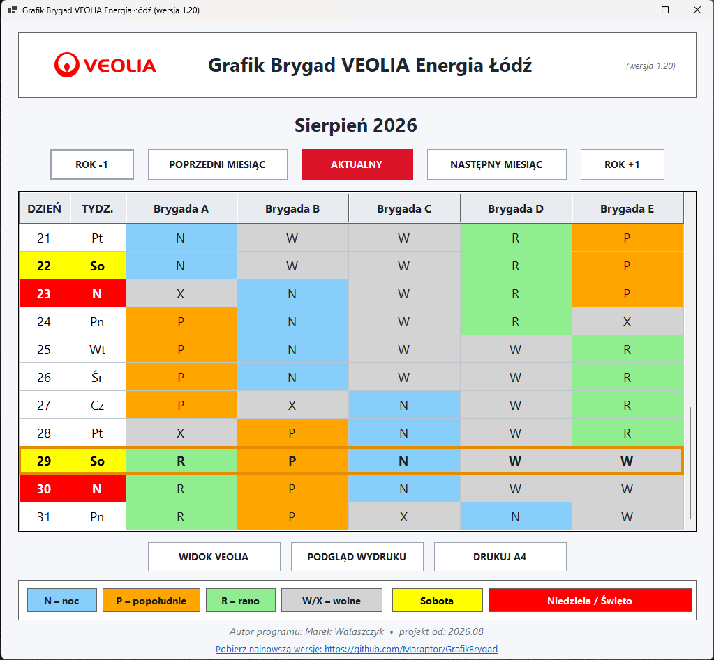
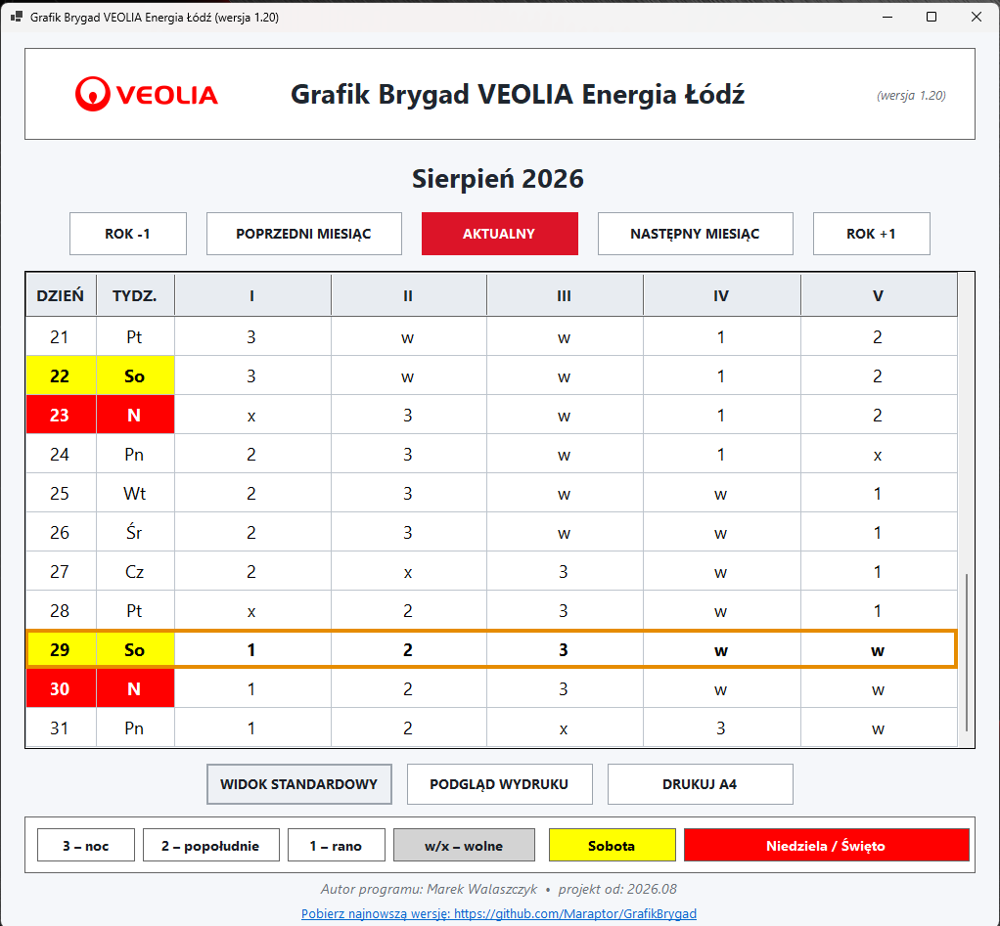
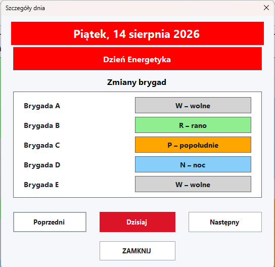

# Grafik Brygad VEOLIA Energia Łódź

Aplikacja Windows Forms w języku C# do prezentowania cyklicznego grafiku
pracy pięciu brygad A--E.

**Aktualna stabilna wersja: v1.20**

## Najważniejsze funkcje

-   automatyczny grafik pięciu brygad,
-   20-dniowy cykl `NNNNXPPPPXRRRRWWWWWW`,
-   widok Standard i widok VEOLIA,
-   obsługa zmian R / P / N oraz dni W / X,
-   niedzielne korekty zmiany R,
-   obsługa świąt i Dnia Energetyka 14 sierpnia,
-   specjalna prezentacja pracy P/N 31 grudnia,
-   nawigacja po dniach, miesiącach i latach,
-   okno Szczegóły dnia,
-   kwartalne i roczne obliczenia okresu rozliczeniowego,
-   podgląd wydruku i drukowanie,
-   skalowanie PerMonitorV2,
-   instalator Windows x64.

## Okres rozliczeniowy

Kliknięcie nagłówka wybranej brygady otwiera kwartalne okno okresu
rozliczeniowego. Program pokazuje:

-   wymiar czasu pracy dla kwartału,
-   liczbę dni pracy R/P/N poszczególnych brygad,
-   liczbę dni do dopracowania do pełnego wymiaru w kwartale,
-   liczbę dni do dopracowania do pełnego wymiaru w całym roku.

## Zrzuty ekranu --- v1.20

### Widok Standard

### Widok VEOLIA

### Szczegóły dnia

### Kwartalny okres rozliczeniowy

## Wymagania projektu

-   Windows,
-   Visual Studio z obsługą aplikacji klasycznych .NET,
-   .NET 10,
-   Windows Forms,
-   konfiguracja docelowa `net10.0-windows`.

Projekt korzysta z plików:

-   `Images/veolia.png`
-   `Images/GrafikBrygad.ico`

## Publikacja

Zalecane ustawienia:

-   Release,
-   win-x64,
-   Self-contained.

Pliki publikacji powinny znaleźć się w:

`publish/win-x64`

Następnie można skompilować skrypt:

`Installer/GrafikBrygad-v1.20.iss`

## Autor

Marek Walaszczyk
